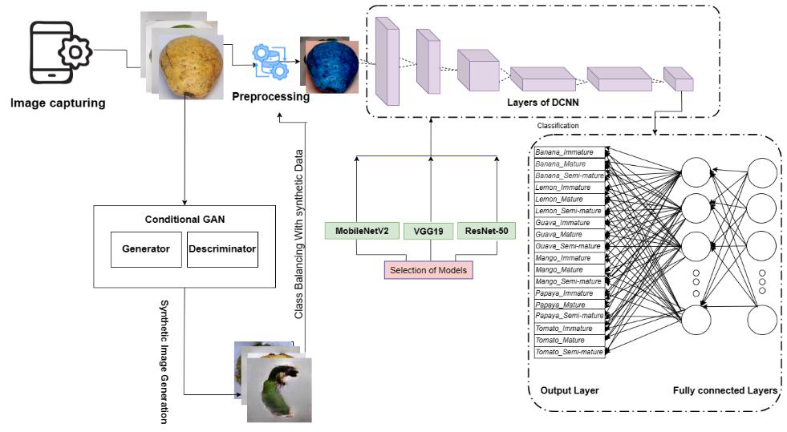
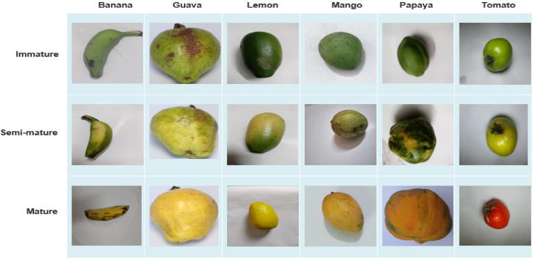
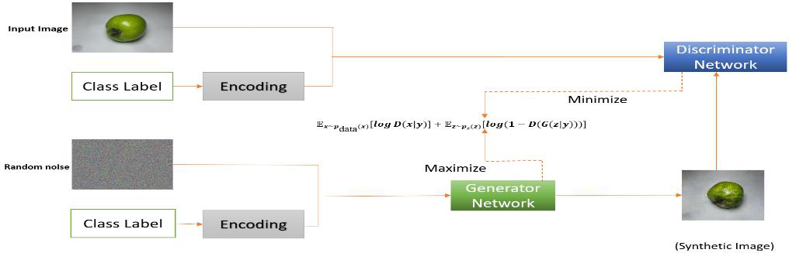
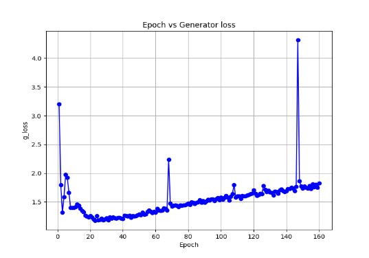
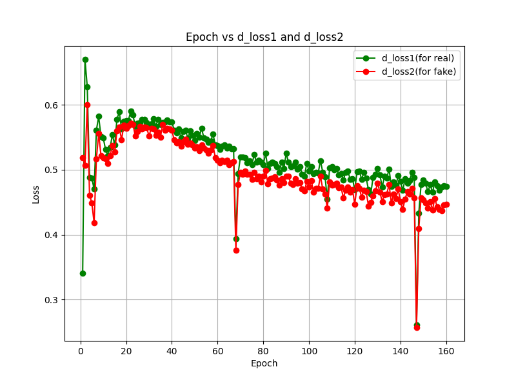
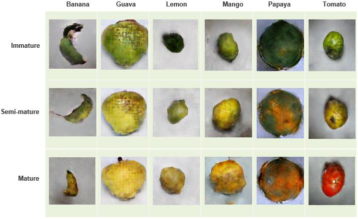
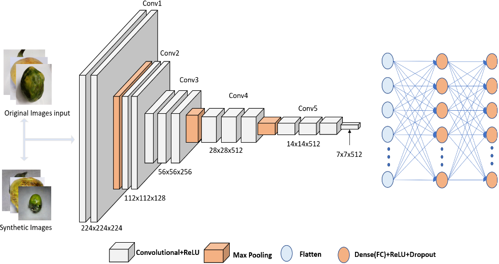
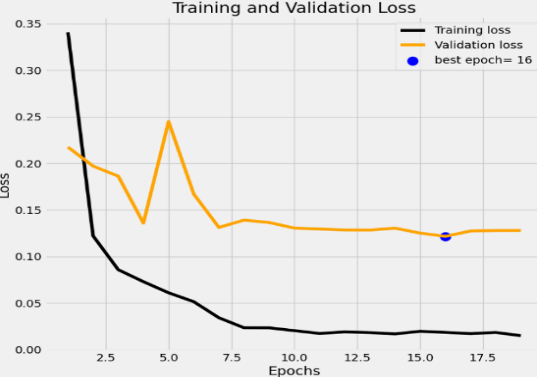
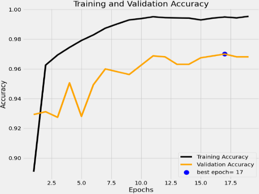
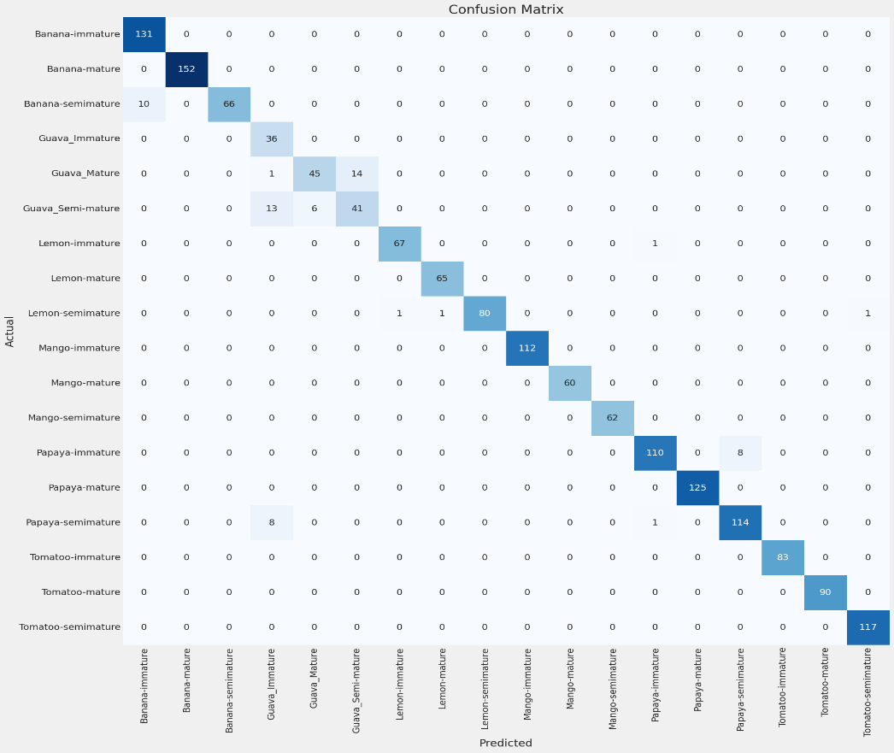

# Empowering Fruit Maturity Stage Classification through Transfer Learning and Conditional GAN Augmentation

**Mahi Sarwar Anol, Md. Sazzadur Ahamed**
Department of Computer Science and Engineering, Daffodil International University, Dhaka, Bangladesh


> **Publication note:** This work was accepted for publication in 2023 but was never formally published. This repository shares the code, figures and results so the research stays openly available.

---

## Overview

Fruits are usually sorted by maturity stage after harvest so they meet consumer needs and keep well on the shelf. Most of this sorting is still done by hand, which is slow and inconsistent. This project proposes a **non-destructive, machine-vision-based system** that classifies fruit maturity from a single photo.

- We built a **custom dataset of 9,866 images** of **6 fruits** (Banana, Guava, Lemon, Mango, Papaya, Tomato), each at **3 maturity stages** (Immature, Semi-mature, Mature). That makes **18 classes**.
- We compared three **transfer learning** backbones: **MobileNetV2, VGG19 and ResNet50**.
- The raw dataset is class-imbalanced, so we trained a **Conditional GAN (cGAN)** to generate class-specific synthetic images and balance the training set.
- **VGG19** went from **93.34% to 95.99%** test accuracy when trained on the cGAN-balanced dataset. It was the best model overall.

<p align="center">
  
  <br><em>Overview of the working framework: image capture → preprocessing → cGAN class balancing → transfer learning → 18-class classification.</em>
</p>

---

## Key Contributions

1. **A new multi-fruit maturity dataset**: 9,866 images collected by hand over about **9 months**, covering 6 fruits × 3 maturity stages.
2. **Maturity stage estimation with deep CNNs**, to help choose the right harvest time and make post-harvest sorting more efficient.
3. **cGAN-based synthetic data augmentation** to reduce class imbalance and bias toward majority classes during training.

---

## Dataset

### Maturity stage definitions

| Characteristic | Immature | Semi-mature | Mature |
|---|---|---|---|
| **Color** | Often green, lighter | Mix of colors, shades in color | Vibrant colors, varies by fruit |
| **Firmness** | Generally firm, less yielding | Moderately firm, starts to soften | Firm but yielding to pressure |
| **Taste** | Less sweet, possibly astringent | Blend of flavors, less intense | Typically sweet, full flavor profile |
| **Sorting use** | Pickling or processing | Intermediate ripeness, varied demands | Immediate consumption or longer shelf life |

### Image acquisition

- Samples came from local and retail markets, farms and gardens. Some fruits, such as mango, are seasonal, which is why collection took about 9 months.
- Each fruit was placed on a **white sheet** under controlled lighting.
- Photos were taken with a **50 MP mobile camera (Sony IMX766 sensor)** for detail and natural color.

<p align="center">
  
  <br><em>Sample images from the collected dataset (rows: maturity stage, columns: fruit).</em>
</p>

### Data split

The dataset was split **70% / 15% / 15%** into train / test / validation.

<details>
<summary><b>Per-class counts in the raw dataset (click to expand)</b></summary>

| Class | Train | Test | Validation |
|---|---:|---:|---:|
| Banana Immature | 539 | 131 | 131 |
| Banana Semi-mature | 291 | 76 | 78 |
| Banana Mature | 703 | 152 | 150 |
| Guava Immature | 162 | 36 | 34 |
| Guava Semi-mature | 280 | 60 | 60 |
| Guava Mature | 280 | 60 | 60 |
| Lemon Immature | 311 | 68 | 66 |
| Lemon Semi-mature | 383 | 83 | 82 |
| Lemon Mature | 297 | 65 | 63 |
| Mango Immature | 518 | 112 | 111 |
| Mango Semi-mature | 282 | 62 | 60 |
| Mango Mature | 280 | 60 | 60 |
| Papaya Immature | 303 | 118 | 113 |
| Papaya Semi-mature | 344 | 123 | 125 |
| Papaya Mature | 334 | 125 | 119 |
| Tomato Immature | 380 | 83 | 81 |
| Tomato Semi-mature | 540 | 117 | 115 |
| Tomato Mature | 420 | 90 | 90 |
| **Total** | **6,647** | **1,621** | **1,598** |

</details>

The training set ranges from **162** images (Guava Immature) to **703** (Banana Mature), which is a clear class imbalance.

---

## Methodology

### 1. Preprocessing

- All images were resized to **224 × 224**.
- **MobileNetV2**: pixels scaled to **[-1, 1]**.
- **VGG19 / ResNet50**: RGB → BGR conversion, then each channel zero-centered against ImageNet means (no scaling).
- All of this uses TensorFlow's built-in `preprocess_input` functions.

### 2. Handling class imbalance with a Conditional GAN

A Conditional GAN ([Mirza & Osindero, 2014](https://arxiv.org/abs/1411.1784)) trains a **generator** and a **discriminator** against each other. Both are conditioned on the class label *y*, so the generator can produce images of a specific fruit and maturity stage on demand.

$$
\min_G \max_D V(D, G) = \mathbb{E}_{x \sim p_{\text{data}}(x)}\big[\log D(x \mid y)\big] + \mathbb{E}_{z \sim p_z(z)}\big[\log\big(1 - D(G(z \mid y))\big)\big]
$$

<p align="center">
  
  <br><em>Process of generating synthetic images with the cGAN.</em>
</p>

**cGAN architecture and training**

| Component | Details |
|---|---|
| Generator input | Latent vector (size 100) + class-label embedding, reshaped to 8 × 8 × 3 |
| Generator | 4 × `Conv2DTranspose` upsampling blocks with LeakyReLU, up to a **128 × 128 × 3** image, `tanh` output |
| Discriminator | 2 × `Conv2D` (128 filters, 3×3 kernel, stride 2) with LeakyReLU, `sigmoid` output |
| Optimizer | Adam (lr = 0.0002, β₁ = 0.5) |
| Batch size | 64 |
| Epochs | **160**. Generated images looked realistic around epoch 97 and became consistently clean after about epoch 154. |

<p align="center">
  
  
  <br><em>Left: generator loss. Right: discriminator loss on real (green) and fake (red) samples.</em>
</p>

<p align="center">
  
  <br><em>cGAN-generated synthetic images after 160 epochs.</em>
</p>

The synthetic images were upscaled to 224 × 224 and added to the real training images so that **every class has exactly 800 training images**:

| | Raw images | Synthetic images | Final train set |
|---|---:|---:|---:|
| **Total (18 classes)** | 6,647 | 7,753 | **14,400** |

<details>
<summary><b>Per-class synthetic image counts (click to expand)</b></summary>

| Class | Raw | Synthetic | Merged |
|---|---:|---:|---:|
| Banana Immature | 539 | 261 | 800 |
| Banana Semi-mature | 291 | 509 | 800 |
| Banana Mature | 703 | 97 | 800 |
| Guava Immature | 162 | 638 | 800 |
| Guava Semi-mature | 280 | 520 | 800 |
| Guava Mature | 280 | 520 | 800 |
| Lemon Immature | 311 | 489 | 800 |
| Lemon Semi-mature | 383 | 417 | 800 |
| Lemon Mature | 297 | 503 | 800 |
| Mango Immature | 518 | 282 | 800 |
| Mango Semi-mature | 282 | 518 | 800 |
| Mango Mature | 280 | 520 | 800 |
| Papaya Immature | 303 | 497 | 800 |
| Papaya Semi-mature | 344 | 456 | 800 |
| Papaya Mature | 334 | 466 | 800 |
| Tomato Immature | 380 | 420 | 800 |
| Tomato Semi-mature | 540 | 260 | 800 |
| Tomato Mature | 420 | 380 | 800 |

</details>

> The validation and test sets contain **only real images**. Synthetic data was used for training only.

### 3. Transfer learning

We fine-tuned three ImageNet-pretrained backbones on both the raw and the cGAN-balanced training sets:

- **MobileNetV2**: lightweight; depthwise separable convolutions, inverted residuals and linear bottlenecks.
- **ResNet50**: 50 layers with residual connections, which avoid vanishing gradients.
- **VGG19**: 16 conv + 3 FC layers built from stacked 3×3 convolutions. This was the best performer.

<p align="center">
  
  <br><em>Proposed model: VGG19 backbone with a custom classification head.</em>
</p>

**Classification head and training setup**

| Setting | Value |
|---|---|
| Head | VGG19 base → Dense(512, ReLU) → Dropout(0.3) → Dense(18, Softmax) |
| Optimizer | Adam, initial lr = 0.001 |
| LR schedule | Reduce on plateau, factor 0.5, patience 1 epoch |
| Early stopping | Monitor `val_loss`, patience 3, restore best weights |
| Input size | 224 × 224 × 3 |
| Hardware | Google Colab, NVIDIA Tesla T4 (15 GB) |

---

## Results

### Model comparison

| Model | Dataset | Test Loss | Test Accuracy |
|---|---|---:|---:|
| MobileNetV2 | Raw | 0.28589 | 92.78% |
| MobileNetV2 | cGAN-augmented | 0.21350 | 95.00% |
| ResNet50 | Raw | 0.30768 | 91.24% |
| ResNet50 | cGAN-augmented | 0.16124 | 95.43% |
| VGG19 | Raw | 0.22485 | 93.34% |
| **VGG19** | **cGAN-augmented** | **0.13056** | **95.99%** |

cGAN augmentation improved **every** model:

- VGG19: +2.65 points
- MobileNetV2: +2.22 points
- ResNet50: +4.19 points

MobileNetV2 reached 95.00% while staying lightweight, which makes it a good fit for mobile and low-power deployment.

### Training curves (VGG19, cGAN-augmented)

<p align="center">
  
  
  <br><em>Left: training vs. validation loss (best epoch 16). Right: training vs. validation accuracy (best epoch 17).</em>
</p>

Early stopping ended training at epoch 19 and restored the best weights from epoch 16, which prevented overfitting.

### Per-class performance (VGG19, cGAN-augmented)

<details>
<summary><b>Precision / Recall / F1 for all 18 classes (click to expand)</b></summary>

| Class | Precision | Recall | F1-score | Support |
|---|---:|---:|---:|---:|
| Banana Immature | 0.93 | 1.00 | 0.96 | 131 |
| Banana Mature | 1.00 | 1.00 | 1.00 | 152 |
| Banana Semi-mature | 1.00 | 0.87 | 0.93 | 76 |
| Guava Immature | 0.62 | 1.00 | 0.77 | 36 |
| Guava Mature | 0.88 | 0.75 | 0.81 | 60 |
| Guava Semi-mature | 0.75 | 0.68 | 0.71 | 60 |
| Lemon Immature | 0.99 | 0.99 | 0.99 | 68 |
| Lemon Mature | 0.98 | 1.00 | 0.99 | 65 |
| Lemon Semi-mature | 1.00 | 0.96 | 0.98 | 83 |
| Mango Immature | 1.00 | 1.00 | 1.00 | 112 |
| Mango Mature | 1.00 | 1.00 | 1.00 | 60 |
| Mango Semi-mature | 1.00 | 1.00 | 1.00 | 62 |
| Papaya Immature | 0.98 | 0.93 | 0.96 | 118 |
| Papaya Mature | 1.00 | 1.00 | 1.00 | 125 |
| Papaya Semi-mature | 0.93 | 0.93 | 0.93 | 123 |
| Tomato Immature | 1.00 | 1.00 | 1.00 | 83 |
| Tomato Mature | 1.00 | 1.00 | 1.00 | 90 |
| Tomato Semi-mature | 0.99 | 1.00 | 1.00 | 117 |
| **Overall accuracy** | | | **95.99%** | **1,621** |

</details>

### Confusion matrix

<p align="center">
  
</p>

- **1,556 of 1,621** test images were classified correctly.
- **Mango** and **Tomato** were classified with **100% accuracy** at all three maturity stages.
- Most errors fall in the **semi-mature** classes, especially for **Guava**, **Banana** and **Papaya**. This is expected because semi-mature fruit visually sits between the other two stages.

---

## Repository Structure

```
.
├── Combine_trainer.ipynb              # Dataset exploration, 70/15/15 split, and batch training of
│                                      # multiple pretrained backbones on the raw dataset
├── TPU+GPU_combined_efficient.ipynb   # Conditional GAN (generator/discriminator) training with
│                                      # TPU/GPU support, checkpointing and synthetic image generation
├── Transfer_learning_code.ipynb       # Transfer learning + fine-tuning on the cGAN-balanced dataset,
│                                      # evaluation (accuracy, F1, classification report, confusion matrix)
├── assets/                            # Figures used in this README (extracted from the paper)
└── README.md
```

## Getting Started

The notebooks were written for **Google Colab** and read data from Google Drive.

1. Open a notebook in Colab (`File → Upload notebook`, or open it from GitHub).
2. Set the runtime to **GPU** (T4 or better). A **TPU** works for the cGAN notebook.
3. Upload your dataset to Google Drive and update the path variables at the top of each notebook (`BASE_DIR`, `zip_file_path`, `extract_to_directory`, etc.).
4. Run the notebooks in this order:
   1. `Combine_trainer.ipynb`: split the data and get baselines on the raw dataset
   2. `TPU+GPU_combined_efficient.ipynb`: train the cGAN and generate synthetic images
   3. `Transfer_learning_code.ipynb`: train and evaluate on the balanced dataset

**Main dependencies:** `tensorflow` / `keras`, `numpy`, `pandas`, `scikit-learn`, `matplotlib`, `seaborn`, `opencv-python`, `scikit-image`, `albumentations`, `Pillow`

The expected dataset layout is one folder per class (e.g. `Banana_Immature/`, `Mango_Semi-mature/`, …) inside `train/`, `validation/` and `test/` directories.

---

## Future Work

- Add **Explainable AI (XAI)** techniques (e.g. Grad-CAM) to show which visual cues drive each prediction and make the model more trustworthy.
- Improve the **semi-mature** classes, which account for most of the errors.
- Deploy the lightweight MobileNetV2 variant in a **mobile app** for on-site sorting.

---

## Citation

If you find this work useful, please cite:

```bibtex
@unpublished{anol2023fruitmaturity,
  title  = {Empowering Fruit Maturity Stage Classification through Transfer Learning and Conditional GAN Augmentation},
  author = {Anol, Mahi Sarwar and Ahamed, Md. Sazzadur},
  note   = {Accepted manuscript, 2023. Department of Computer Science and Engineering, Daffodil International University},
  year   = {2023}
}
```

## Authors

- **Mahi Sarwar Anol**: [mahi15-13664@diu.edu.bd](mailto:mahi15-13664@diu.edu.bd)
- **Md. Sazzadur Ahamed**: [sazzad.cse@diu.edu.bd](mailto:sazzad.cse@diu.edu.bd)

Department of Computer Science and Engineering, Daffodil International University, Dhaka, Bangladesh.
